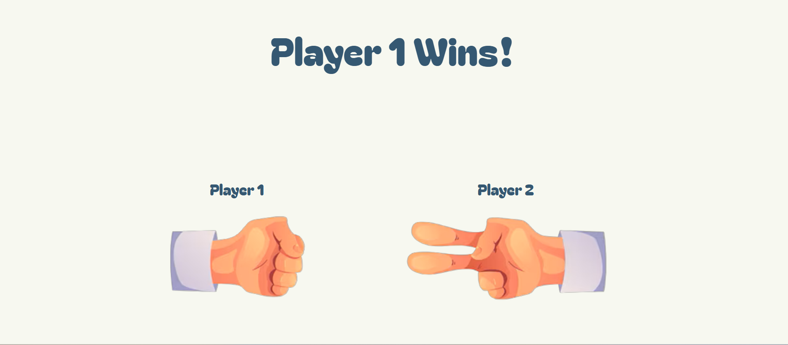

# Rock, Paper, Scissors... Shoot!🪨✂️
A simple Rock, Paper, Scissors game built with HTML, CSS, and JavaScript. Each refresh generates random choices for Player 1 and Player 2,
updates the hand images, and displays the winner!
## Features⚙️
- Random choice generation for both players
- Dynamic image updates based on the result
- Winner announcement (Player 1, Player 2, or tie)
- Refresh to play again
## Tech Stack✨
- HTML
- CSS
- JavaScript (DOM manipulation)
  
### This project was built as a personal challenge to test my understanding of core JavaScript and DOM concepts after a one-month break from coding due to laptop damage.
### I initially tried to adapt logic from a previous Dice Game project, but due to the different game mechanics, I had to rethink the structure and implement my own solution. The commented sections show part of that experimentation process.
### This project marks my return to consistent coding practice and reflects my ability to apply learned concepts independently.

